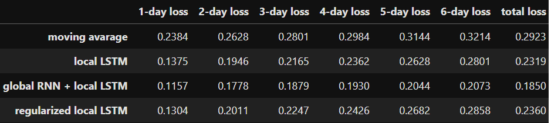

## Table of Contents  

- [1. Regression](#1-regression)  
  - [1.1 Predicting House Prices](#11-predicting-house-prices)  
- [2. Computer Vision - Classification](#2-computer-vision---classification)  
  - [2.1 CIFAR-10 Image Classification](#21-cifar-10-image-classification)  
  - [2.2 Brain Tumor Classification](#22-brain-tumor-classification)  
- [3. Time Series - Forecasting](#3-time-series---forecasting)  
  - [3.1 Weather Forecasting](#31-weather-forecasting)

# 1. Regression

## 1.1 Predicting House Prices

**Dataset:** The [dataset](https://www.kaggle.com/competitions/house-prices-advanced-regression-techniques) comprises 1,460 entries and features, detailing various house properties and their corresponding sale prices. 

**Aim:** Build a regression model to predict house sale prices based on their property features.

**Model:** A four-layer multi-layer perceptron (MLP). 

# 2. Computer Vision - Classification

## 2.1 CIFAR-10 Image Classification

This folder contains three Jupyter notebooks that explore different deep learning models to image classification on the CIFAR-10 dataset. Each notebook leverages a unique architecture, ranging from a custom convolutional neural network to state-of-the-art pretrained models.

**Dataset:** The [CIFAR-10](https://www.cs.toronto.edu/~kriz/cifar.html) dataset consists of 60,000 32x32 color images in 10 classes, with 6,000 images per class. The goal of this project is to classify these images into their respective categories using various deep learning models.

**Models:**

i) **VGG-16-like Architecture (Built from Scratch)**

- Implements a custom VGG-16-inspired convolutional neural network architecture.
- Designed and trained from scratch for the CIFAR-10 dataset.

ii) **ResNet-18 (Pretrained on ImageNet)**

- Fine-tunes a ResNet-18 model pretrained on the ImageNet dataset for CIFAR-10 classification.
- Trains a randomly initialized ResNet-18 model for comparison.

iii) **Vision Transformer (Pretrained on ImageNet)**

- Fine-tunes a Vision Transformer (ViT) model pretrained on the ImageNet dataset for CIFAR-10 classification.
- Utilizes self-attention mechanisms to capture global image features.
- Adapts the pretrained ViT model to handle the smaller size and specific characteristics of CIFAR-10.

## 2.2 Brain Tumor Classification

This project focuses on classifying brain tumor types using the Brain Tumor MRI Dataset. Two state-of-the-art architectures, Vision Transformers (ViT) and ResNet, are compared to evaluate their performance.

**Dataset:** The [Brain Tumor MRI dataset](https://www.kaggle.com/datasets/masoudnickparvar/brain-tumor-mri-dataset) consists of 7,023 images, each labeled into one of four categories: 'glioma,' 'meningioma,' 'pituitary,' or 'no tumor.'

**Models:**
- **Vision Transformer (ViT):** Achieves 96.72% accuracy on the test set.
- **ResNet50:** Achieves 95.7% accuracy on the test set.
  
**Pretraining and Training:** Both models use ImageNet pretrained weights and are fine-tuned on the dataset.

# 3. Time Series - Forecasting

## 3.1 Weather Forecasting

**Dataset:** The [dataset](https://github.com/florian-huber/weather_prediction_dataset) contains daily recorded weather data from 2000 to 2010 for 18 European cities. For this project, we focus on the maximum temperature in Basel.

**Aim:** Develop models to predict 7-day weather forecasts from scratch and compare performance.

**Models:** 

*1. Local Model*

 - Train an autoregressive LSTM model that uses previous 14-days data to predict the next 7 days. 
 - Experiment with key hyperparameters, including input sequence length, hidden layer size, and the number of hidden layers, to identify the optimal configuration.

*2. Global Model*

 - Develop a recurrent model designed for long-range forecasting by leveraging extended historical data.
 - Conduct a thorough search for the best-performing hyperparameters to improve the accuracy of long-term predictions.
 
*3. Hybrid Model*

 - Use the global model to generate long-range weather predictions.
 - Refine these predictions with the local model to achieve greater accuracy for the immediate 7-day forecast.

 *4. Regularized Local Model*

 - Enhance the complexity and robustness of the local LSTM by introducing additional linear layers together with layer normalization, and residual maps.

**Results:** The local model, hybrid model, regularized local model and moving average are compared on the test set using mean squared error (MSE) as the loss function. Combining the local model with the global model resulted in improved model performance.

